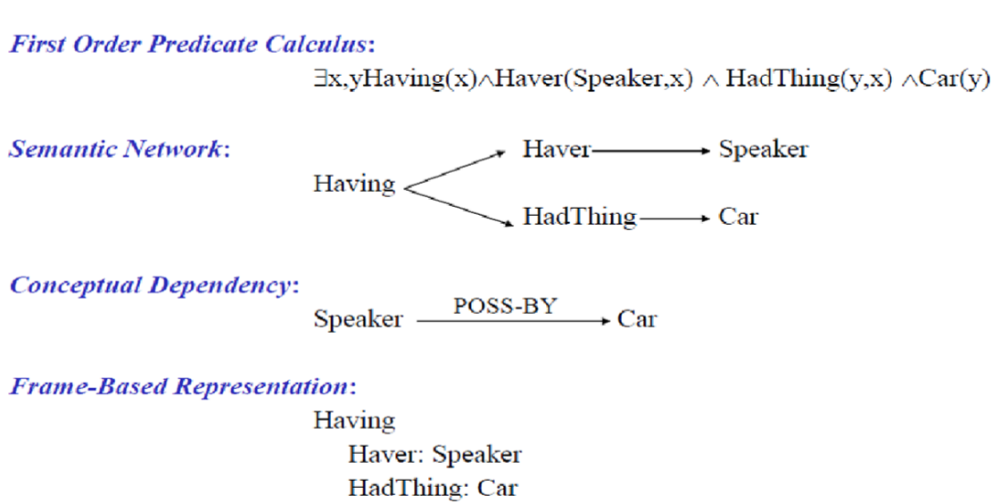

# NLP Theory

* What is semantic analysis? Explain approaches to semantic analysis.
  * The word Semantics means study of meaning
  * Semantic analysis is the process of finding out meaning from the text
  * It is an important sub-task in NLP
  * It is done by analyzing their grammatical structure and distinguishing relationships between individual words in a specific context
  * Applications are chatbots search engines and text analysis
  * Additional application - Industries analyzing emails comments and feedback
  * Two parts
    * Lexical Semantic Analysis
      * Studying meaning of individual word
    * Compositional Semantics Analysis
      * Studying meaning of combination of words
  * Approaches(as per ma'am's notes)
    * First Order Predicate Calculus (FOPC)
      * FOPC is expressive enough to handle a lot of things
      * FOPC is a flexible, well-understood, and computationally tractable approach.
      * FOPC provides a computational basis for verifiability, inference, and expressiveness requirements
      * In fact, it is claimed that anything can be representable with other representation language, it can be also representable with FOPC.
    * example
      * 

* Define the following
  * Homonymy
    * same spelling
    * same pronounciation
    * different meaning
    * example
      * bat
        * sport equipment
        * flying mammal
      * bank
        * river border
        * money place
  * Polysemy
    * a single word form is associated with two or several __related__ senses
    * example
      * Man
        * The human species (i.e., man vs. other organisms)
        * Males of the human species (i.e., man vs. woman)
        * Adult males of the human species (i.e., man vs. boy)
        * (As a verb) to operate or constitute a vehicle or machine (To man a ship)
  * Synonymy
    * similar meaning not exactly same but related
    * example
      * cute - pretty
      * rich wealthy
  * Antonomy
    * close to opposite meaning
    * example
      * good - bad
      * right - wrong
  * Hypernomy
    * super class of something
    * example
      * animal is hypernomy of dog
      * fruit is hypernomy of tomato
  * Hyponomy
    * subclass of something
    * example
      * dog is hyponomy of animal
      * tomato is hyponomy fruit
  * Meronymy
    * constituent part of something
      * nails are meronymy of fingers
      * screen is meronomy of phone

